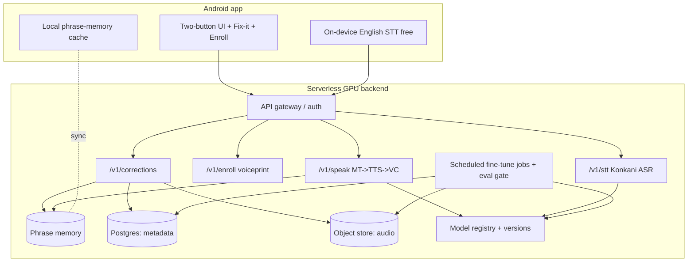
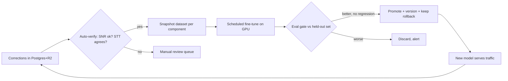

# Konkani ⇄ English Voice Translator — Architecture & Plan

**Status:** Finalized (v1.0) · Decisions locked (§16) · App shipped as **Alfred** (Stage 0 + Hindi mode, Clips recorder, practice/recap drills, atmospheres) · Backend Stages 1-3 code-complete incl. Konkani ASR (deploy to run) · **Last updated:** 2026-09-22

> A two-way, turn-based voice translator between **English** and **Konkani** that (a) speaks
> Konkani back **in the user's own cloned voice**, and (b) **improves over time** from local speakers'
> corrections. Fully **open-source models**, self-hosted on **serverless cloud GPU**. No per-minute
> vendor fees; every component is one we can retrain.

---

## 1. Goals / Non-goals

**Goals**
- Konkani speech → English text (+ optional English audio) — user understands the other person.
- English speech → **Konkani audio in the user's voice** — the other person hears "you" speaking Konkani.
- A **correction loop**: when Konkani is wrong, a local speaker says it correctly; we store it,
  reuse it instantly, and periodically **fine-tune** our models on it. More corrections → better Konkani.
- Everything runs on **open-source, self-hostable, fine-tunable** models.

**Non-goals (for now)**
- Not real-time simultaneous interpretation — it is **turn-based** (tap → speak → result).
- Not a general N-language translator — **Konkani ⇄ English only**.
- iOS is out of scope — **Android** only.
- Not a fully on-device system — voice cloning + our own models need a **GPU backend**.

---

## 2. Product flows (recap)

**A. Konkani → English** (no voice cloning needed)
`Konkani speech → STT(kok) → Konkani text → MT(kok→en) → English text (shown + optionally spoken)`

**B. English → Konkani, in the user's voice** (the hard path)
`English speech → STT(en) → English text → MT(en→kok) → Konkani text → TTS+voice-clone → Konkani audio in YOUR voice`

**C. Correction** (on any Konkani output)
`Tap "👎 Fix it" → a local speaker says the correct Konkani → capture {english source, our konkani, speaker audio, confirmed text} → phrase memory (instant) + training queue (batch)`

**One-time enrollment:** user records ~30 s of their voice (reading **English** is fine — timbre is
language-independent) → produces a `voice_id` used for all Konkani output.

---

## 3. System overview



**Three tiers**
1. **Android app** — mic capture, playback, Fix-it UI, enrollment, local phrase-memory cache, graceful
   offline fallback to the phone's built-in Google engine.
2. **Serverless GPU backend** — stateless inference functions (scale-to-zero) + scheduled training jobs.
3. **Data plane** — Postgres (metadata) + object storage (audio) + a model registry (versioned weights).

---

## 4. Open-source model stack

| Role | Model (primary) | HF/repo | License | Fine-tune? |
|---|---|---|---|---|
| English STT | on-device Google STT **or** `faster-whisper` large-v3 | openai/whisper | MIT | (English fine, rarely needed) |
| Konkani STT (corrections, reverse dir) | **IndicConformer** (kok) | AI4Bharat/IndicConformerASR | permissive | ✅ on speaker audio |
| MT En⇄Kok | **IndicTrans2** 1B (or 200M distilled) | ai4bharat/indictrans2-* | MIT | ✅ LoRA on corrected pairs |
| Konkani TTS + voice clone (**preferred**) | **IndicF5** (F5-TTS, zero-shot voice clone) | AI4Bharat/IndicF5 | check | ✅ + clones from ref clip |
| Konkani TTS (fallback) | **Indic Parler-TTS** | ai4bharat/indic-parler-tts | Apache-2.0 | ✅ on speaker audio |
| Voice conversion (fallback, 2-stage) | **seed-vc** (or RVC) | Plachtaa/seed-vc | check | zero-shot ref |
| Bootstrap training data | **IndicVoices-R** (1,704 h, incl. Konkani) | AI4Bharat/IndicVoices-R | CC | dataset |

**Key decision — TTS + voice cloning:** two viable designs.
- **Path 1 (preferred): IndicF5.** F5-TTS is a *zero-shot voice-cloning* TTS. If it renders Konkani from
  text **in a reference speaker's voice**, then `speak(konkani_text, ref=your_clip)` does TTS **and** the
  clone in **one model** — no separate VC stage. Must validate cross-lingual clone (English ref → Konkani
  out) early (Stage 2 acceptance test).
- **Path 2 (fallback): Indic Parler-TTS → seed-vc.** Parler makes generic Konkani audio; seed-vc re-timbres
  it to the user's voice. Two models, more moving parts, proven language-agnostic.

Build the backend so TTS-and-clone sits behind **one interface** (`synthesize_konkani(text, voice_id)`), so
we can swap Path 1 ⇄ Path 2 without touching the app.

**Cost optimization — English STT stays on-device.** The phone already does English STT free and instantly.
Send **text** (not audio) to the backend for the En→Kok path → less GPU, lower latency, better privacy.
Backend Whisper remains available for quality/consistency if needed.

---

## 5. Backend API contract

Base: `https://api.<yourapp>.dev/v1` · Auth: `Authorization: Bearer <app_api_key>` · JSON unless noted.
All audio is base64 or `multipart/form-data`; responses reference stored audio by URL.

### `POST /v1/speak` — English → Konkani in the user's voice (composite; main flow)
```jsonc
// request
{ "voice_id": "vp_abc123",
  "english_text": "Where is the hospital?",   // OR "english_audio": "<b64>"
  "session_id": "s_789" }                       // keeps a warm GPU during a conversation
// response
{ "request_id": "utt_555",
  "konkani_text": "हॉस्पिटल खंय आसा?",
  "konkani_audio_url": "https://.../utt_555.opus",
  "translation_source": "memory" | "model",     // did phrase memory hit?
  "model_versions": { "mt": "it2-2026.09", "tts": "indicf5-2026.08" } }
```

### `POST /v1/stt` — speech → text (Konkani side / corrections)
```jsonc
{ "lang": "kok", "audio": "<b64>" }
-> { "text": "…", "confidence": 0.72, "lang": "kok" }
```

### `POST /v1/translate` — text → text (checks phrase memory, then IndicTrans2)
```jsonc
{ "text": "Thank you", "source": "en", "target": "kok" }
-> { "translated": "…", "source_used": "memory"|"model", "model_version": "it2-2026.09" }
```

### `POST /v1/enroll` — register the user's voice
```jsonc
{ "user_id": "u_1", "audio": "<b64 ~30s>", "consent": true }
-> { "voice_id": "vp_abc123" }
```

### `POST /v1/corrections` — submit a local speaker's correction
```jsonc
{ "request_id": "utt_555",              // the utterance being fixed (nullable)
  "english_source": "Where is the hospital?",
  "our_konkani_text": "…wrong…",
  "native_audio": "<b64>",              // REQUIRED — used for TTS/STT training
  "native_confirmed_text": "हॉस्पिटल खंय आसा?", // drafted by STT, speaker-verified (nullable)
  "corrector": { "region": "Bardez", "dialect": "Bardeshi", "script": "Devanagari", "consent": true } }
-> { "correction_id": "cor_222", "phrase_memory_updated": true }
```

### Utility
- `GET /v1/health` → liveness. `GET /v1/version` → current model versions.
- `GET /v1/phrase?english=<text>` → phrase-memory lookup (or folded into `/speak`).

---

## 6. Data model

**Postgres (metadata)** — managed (Neon/Supabase); free tier fine to start.
```sql
voice_profiles(voice_id PK, user_id, created_at, ref_audio_uri, embedding_uri, consent bool)

utterances(request_id PK, ts, direction,           -- 'en2kok' | 'kok2en'
  source_text, source_audio_uri, output_text, output_audio_uri,
  translation_source,                              -- 'memory' | 'model'
  model_versions jsonb, user_id)

corrections(correction_id PK, request_id FK NULL, created_at,
  english_source, our_konkani_text,
  native_audio_uri, native_confirmed_text NULL,
  region, dialect, script, consent bool,
  status,                                          -- new|verified|in_dataset|trained|rejected
  quality jsonb)                                   -- snr, stt_agreement, duration…

phrase_memory(id PK, english_norm UNIQUE, konkani_text,
  konkani_audio_uri NULL,                          -- speaker audio preferred for playback
  source,                                          -- 'native_correction'|'manual'
  confidence, updated_at)

training_runs(run_id PK, component, base_model, dataset_snapshot_id,
  metrics_before jsonb, metrics_after jsonb, artifact_uri, deployed bool, created_at)

dataset_snapshots(snapshot_id PK, component, correction_ids jsonb, created_at)
```

**Object storage (audio)** — Cloudflare R2 or S3 (cheap, encrypted at rest).
```
r2://voice-profiles/<voice_id>/ref.wav
r2://utterances/<request_id>/{source,output}.opus
r2://corrections/<correction_id>/speaker.wav
r2://datasets/<snapshot_id>/…            # materialized training sets
r2://models/<component>/<version>/…      # weights (or a model registry / HF private repo)
```

---

## 7. Phrase memory (instant learning layer)

Purpose: a correction should feel like it took effect **immediately**, even though model retraining is batched.

- **Key:** `english_norm` = lowercase, trim, strip punctuation; optional embedding for fuzzy match
  (sentence-transformers) so near-identical English hits the same entry.
- **On `/speak` / `/translate`:** look up phrase memory first. Hit → return the **speaker-confirmed Konkani
  text** and, if present, **play the speaker's actual audio** (or re-clone it to the user's voice). Miss →
  fall through to IndicTrans2 + TTS.
- **On `/corrections`:** upsert the entry synchronously → next identical/near request is correct instantly.
- **App-side cache:** sync top-N phrases to the phone so corrected phrases work **offline** too.

Phrase memory = short-term memory (instant); fine-tuning = long-term memory (generalizes). Both required.

---

## 8. Correction → training flywheel



**Datasets built from corrections**
- **MT:** `(english_source → native_confirmed_text)` → fine-tune IndicTrans2 (LoRA).
- **TTS:** `(native_confirmed_text → native_audio)` → fine-tune IndicF5/Parler (pronunciation, prosody, multi-speaker).
- **STT:** `(native_audio → native_confirmed_text)` → fine-tune IndicConformer.

**Auto-verification (cheap gate before training):** accept a correction if the recording's SNR is adequate,
duration is sane, and an independent STT transcription agrees with the confirmed text above a threshold;
else route to a light human review queue. Prevents garbage-in.

**Eval gate (critical — never ship a worse model)** — reserve a held-out slice of corrections:
- MT → **chrF/BLEU** vs speaker references.
- TTS → intelligibility via **STT round-trip WER** + speaker-similarity for the clone.
- STT → **WER**.
Promote **only** if metrics improve with no regression on a frozen regression set. Keep previous version for
one-click **rollback**. Log `model_versions` on every utterance for traceability and A/B.

**North-star metric:** **correction rate per 100 utterances** — should trend **down** over time. That single
number tells you the flywheel is working.

**Cadence:** start monthly (cost-efficient); move to weekly as correction volume grows.

---

## 9. Deployment (serverless GPU)

**Recommended platform: [Modal](https://modal.com)** — Python-native serverless GPU, **scale-to-zero**,
per-second billing, GPU functions **and** scheduled (cron) jobs in one place, Volumes for weights, easy
secrets. Alternatives: **RunPod Serverless** (cheapest GPUs), **Replicate** (push-model-get-endpoint, simplest
but less flexible for training), **Baseten**.

**Topology**
- **One container image** bundling all inference models; weights on a fast **Volume** (loaded once per warm
  container). GPU: **L4 / A10G** class is plenty for turn-based inference (A100 only for training).
- **Inference functions:** `speak`, `stt`, `enroll` (GPU); `corrections` (CPU — just stores + updates memory).
- **Scale-to-zero** when idle → **$0**. `keep_warm=1` **per active `session_id`** so a live conversation
  avoids cold starts; container idles down after the chat.
- **Scheduled functions:** `finetune_mt`, `finetune_tts`, `finetune_stt`, each cron-triggered → build dataset
  snapshot → train → eval gate → promote/rollback.
- **Data:** Neon Postgres + Cloudflare R2 (or S3). Model registry = versioned prefix in R2 or a private HF repo.
- **Region:** choose closest to India (lower latency); confirm platform region availability.

**Latency budget (turn-based, acceptable):** on-device English STT (~instant) → network → warm GPU
`translate+TTS+clone` (~2–4 s) → stream audio back. Cold start (first request of a session) adds model-load
seconds; mitigated by session keep-warm.

---

## 10. Cost model (serverless, open-source)

**Software/models:** **$0** (open licenses). **Real cost = GPU-seconds + storage.**

| Item | Basis | Light personal use | Small pilot (community) |
|---|---|---|---|
| Inference | ~2–4 GPU-s/utterance on L4 (~$0.80/hr ⇒ ~$0.0004–0.001/utt); idle = $0 | 2k utt/mo ⇒ **< $2** | 50k utt/mo ⇒ **~$20–40** |
| Fine-tune | ~1–3 GPU-h/run on A10/A100 (~$1–4/h) | monthly ⇒ **~$3–12** | weekly ⇒ **~$15–60** |
| Postgres | Neon free tier | **$0** | **$0–20** |
| Object storage | R2 ~$0.015/GB, no egress | **cents** | **~$1–5** |
| **Total** | | **~$5–15 / mo** | **~$40–125 / mo** |

No per-minute API fees. Contrast: ElevenLabs voice-changer alone is **$0.12/min** and **cannot** learn
Konkani — ruled out by the open-source requirement anyway. Play Store publish: **$25 one-time** (optional).

---

## 11. Privacy, consent & licensing (required — you record other people's voices)

- **Consent before recording** a native corrector: one-tap "I agree my voice may be used to improve Konkani."
  Store `consent=true` with each correction; refuse to train on non-consented audio.
- **User voiceprint** (`voice_id`): treat as biometric/sensitive; encrypt at rest; allow delete.
- **Conversation audio** may contain personal info: define **retention** (e.g., raw audio auto-deleted after
  dataset extraction), support **deletion requests**, minimize what's stored.
- **Data license (DECIDED):** contributors grant a license and we **open-source the resulting Konkani corpus**
  back to the community (mirrors AI4Bharat). Requires an explicit consent + contribution-license screen.
- Encrypt in transit (TLS) and at rest; per-user data isolation; API keys rotated.

---

## 12. Konkani-specific concerns

- **Script (DECIDED):** show Konkani in **both Devanagari and Roman**, user-**toggle**. Models output Devanagari;
  Roman via transliteration (ICU `Devanagari-Latin`) for now. Note traditional **Romi** (Catholic) spelling
  differs from mechanical transliteration, so native corrections will supply authentic Romi. Audio unaffected.
- **Dialect (DECIDED):** primary target = **Bardez, Catholic Konkani** (Roman-leaning). Capture each corrector's
  region/dialect/script in metadata; branch/weight per-dialect later. Catholic → Roman is the everyday script for
  this audience, so the Roman toggle is first-class.
- **Cold-start data:** seed models with IndicVoices-R + community sets **before** launch so day-1 quality is
  usable, then let corrections specialize it.
- **Typography & fonts (DECIDED direction):** one **harmonised family across Latin + Devanagari**. Ship
  **Noto Sans + Noto Sans Devanagari** (SIL OFL, free, legal to embed) as the default; support **Nokia Pure**
  (Dalton Maag — Latin + Devanagari confirmed as one family) as a **drop-in** via `assets/fonts/`. The English/
  Roman box uses the Latin cut, the Konkani box the Devanagari cut; falls back to system fonts if absent.
  ⚠️ **Licensing gate:** Nokia Pure is proprietary — obtain files from Dalton Maag (never web copies) and confirm
  the licence explicitly permits **mobile-app embedding** (desktop licences usually do not).

---

## 13. Security & observability
- **Security:** per-instance API keys + rate limiting; TLS; encrypted storage; least-privilege cloud IAM;
  secrets in the platform vault; abuse/DoS limits on `/speak`.
- **Observability:** structured logs per `request_id`; dashboards for latency (p50/p95), GPU cost/day,
  correction rate (north-star), phrase-memory hit rate, model-version A/B, training-run metrics history.

---

## 14. Risks & mitigations

| Risk | Mitigation |
|---|---|
| Base Konkani MT/TTS still rough | Phrase memory (instant fixes) + fast correction loop; set expectations |
| IndicF5 cross-lingual clone unproven for Konkani | Stage-2 acceptance test with a real clip; fallback = Parler + seed-vc |
| Flywheel could **degrade** models | **Eval gate + frozen regression set + rollback**; never auto-promote a worse model |
| Cold-start latency | Session `keep_warm`; models preloaded on Volume |
| Garbage corrections | Auto-verify (SNR + STT agreement) + light human review |
| Sparse data at start | Bootstrap on IndicVoices-R; recruit a few native contributors early |
| Privacy/legal (voice data) | Explicit consent, retention limits, deletion, encryption (§11) |
| Vendor lock-in | Open models + one-interface abstraction; portable across Modal/RunPod/own-box |

---

## 15. Staged roadmap & acceptance criteria

| Stage | Deliverable | GPU? | Done when |
|---|---|---|---|
| **0. Flywheel scaffolding** | App: Fix-it capture + phrase memory + enrollment stub + **pluggable backend** (Google still powering translation/TTS); correction **data schema**; local mock backend | ❌ | On the emulator: speak English → Konkani; tap Fix-it → record native audio → correction stored in schema → same phrase replays the correction instantly |
| **1. Our own brain** | Serverless backend: `/stt` `/translate` `/speak` on Whisper + IndicTrans2 + Indic TTS; app switched off Google | ✅ | `/speak` returns Konkani text+audio from **our** models; quality ≈ Google on a 50-phrase set |
| **2. Your voice** | Enrollment + IndicF5 clone (or Parler+seed-vc); `voice_id` applied | ✅ | Output Konkani is clearly the **user's timbre**; intelligibility WER within target |
| **3. Self-improvement** | Fine-tune jobs + auto-verify + **eval gate** + rollback + dashboards | ✅ | A retrain from real corrections **passes the gate** and measurably lowers correction rate |

Rough effort: Stage 0 ~days; Stage 1 ~1–2 weeks; Stage 2 ~1 week + validation; Stage 3 ~1–2 weeks + ongoing.

---

## 16. Resolved decisions (v1.0 — locked 2026-09-21)

1. **On-screen Konkani script:** **both Devanagari and Roman**, user-toggle (Roman first-class for Catholic).
2. **Primary dialect/region:** **Bardez, Catholic Konkani** (Roman-leaning).
3. **Open-source the collected corpus:** **Yes** — consent + contribution-license screen required.
4. **Cloud account / budget:** **user-owned** (Modal + Neon + R2); **~$50/mo cap** for the pilot.
5. **Launch volume:** **10 pilot users + 5 native contributors**.
6. **English STT:** **on-device** (free, instant); Konkani STT on backend so it stays improvable.
7. **Fonts:** Noto (default, OFL) with **Nokia Pure** drop-in, pending app-embedding licence (§12).

---

## Appendix — key decisions & alternatives

- **Serverless GPU = Modal** (scale-to-zero + training in one place). Alt: RunPod (cheaper), Replicate (simplest), Baseten.
- **TTS+clone = IndicF5 single-model** (preferred) vs **Parler-TTS + seed-vc two-stage** (fallback). Abstracted behind one interface.
- **MT = IndicTrans2** (Indic-specialized, MIT) vs NLLB-200 (broader, heavier). IndicTrans2 preferred for Konkani quality + fine-tuning.
- **English STT on-device** to cut GPU cost/latency; Konkani STT on backend so it's improvable.
- **Instant learning = phrase memory**, **durable learning = eval-gated fine-tuning**. Both, not either.
